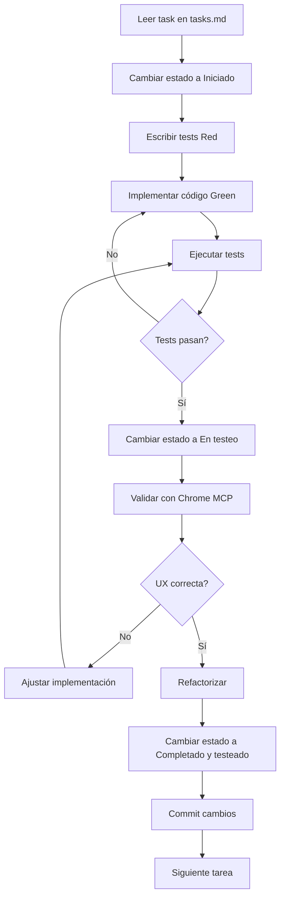

# Claude Project Instructions

## Landing Page Organic Growth - Facundo Zupel

---

## 🎯 Objetivo del Proyecto

Crear una landing page profesional con sección de blog para servicios de consultoría en Organic Growth y Automatizaciones, utilizando React con Astro y siguiendo principios de UX excepcional y corriendo con SSR en un futuro en una VPS.

---

## 🚨 INSTRUCCIÓN CRÍTICA - WORKFLOW OBLIGATORIO

**ANTES DE CUALQUIER TAREA, SIEMPRE:**

1. ✅ **Leer `planning.md`** al inicio de cada sesión
2. ✅ **Revisar `tasks.md`** antes de comenzar cualquier trabajo
3. ✅ **Actualizar `tasks.md`** a medida que:
   - Se descubren nuevas tareas
   - Se completan tareas existentes
   - Cambia el estado de una tarea

**⚠️ Esta es la directiva más importante del proyecto. No trabajar sin seguir este flujo.**

---

## 🧪 Metodología: Test-Driven Development (TDD)

### Proceso Obligatorio por Tarea

Para **CADA** task en `tasks.md`:

1. **Escribir el test primero** (Red)
   - Crear test que falle
   - Definir comportamiento esperado

2. **Implementar código mínimo** (Green)
   - Escribir código para pasar el test
   - No agregar funcionalidad extra

3. **Refactorizar** (Refactor)
   - Limpiar código
   - Optimizar
   - Mantener tests pasando

4. **Verificar antes de continuar**
   - Todos los tests deben pasar
   - No avanzar al siguiente task hasta completar TDD

### Framework de Testing

- **Componentes React**: Vitest + React Testing Library
- **E2E**: Playwright o Cypress
- **UX Testing**: Chrome MCP para validación visual

---

## 📊 Estados de Tareas en tasks.md

Cada tarea debe estar marcada con uno de estos estados:
**IMPORTANTE** que siempre marques el tasks.md cuando hagas una tarea o esté en algún proceso del desarrollo.

```markdown
- [ ] **[No iniciado]** Nombre de la tarea
- [ ] **[Iniciado]** Nombre de la tarea
- [ ] **[En testeo]** Nombre de la tarea
- [x] **[Completado y testeado]** Nombre de la tarea
```

### Criterios por Estado

| Estado                    | Criterio                                  | Acción             |
| ------------------------- | ----------------------------------------- | ------------------ |
| **No iniciado**           | Tarea identificada pero no comenzada      | Leer requirements  |
| **Iniciado**              | Tests escritos, implementación en proceso | Escribir código    |
| **En testeo**             | Código implementado, verificando tests    | Ejecutar TDD cycle |
| **Completado y testeado** | Todos los tests pasan, code review ok     | Marcar como ✅     |

---

## 🛠️ Stack Tecnológico

### Core

- **Framework**: Astro 4.x
- **UI Library**: React 18+
- **Styling**: TailwindCSS v4
- **Testing**: Vitest + React Testing Library
- **E2E**: Playwright

### Backend

- **Blog API**: Astro API Routes (Node.js) - Integrado en el mismo proyecto frontend
- **Lead Storage**: Google Sheets vía Webhook externo
- **Authentication**: HTTP Basic Auth para endpoints `/api/admin/*`
- **Blog Storage**: Archivos `.md` en filesystem (`src/content/blog/`)

### Arquitectura

```
┌─────────────────────────────────────────────────────────┐
│         Frontend + Blog API (Astro + React)             │
│            Puerto: 4321 (dev) / 3000 (prod)             │
│                                                          │
│  ┌─────────────────────────────────────────────────┐   │
│  │  Astro API Routes: /api/admin/posts/*           │   │
│  │  - POST   /api/admin/posts                      │   │
│  │  - GET    /api/admin/posts                      │   │
│  │  - GET    /api/admin/posts/{slug}               │   │
│  │  - PUT    /api/admin/posts/{slug}               │   │
│  │  - DELETE /api/admin/posts/{slug}               │   │
│  └──────────────────┬──────────────────────────────┘   │
│                     │                                    │
│                     ▼                                    │
│  ┌─────────────────────────────────────────────────┐   │
│  │  Filesystem Storage                              │   │
│  │  src/content/blog/*.md                           │   │
│  │  ✅ Persiste entre restarts                     │   │
│  │  ✅ Versionado con Git                           │   │
│  │  ✅ Backup automático en GitHub                  │   │
│  └─────────────────────────────────────────────────┘   │
└─────────────────────────────────────────────────────────┘
                     │
                     ▼
          ┌──────────────────────┐
          │   Webhook Externo    │
          │   (Lead Capture)     │
          │   → Google Sheets    │
          └──────────────────────┘
```

### Servicios

#### 1. Blog API (Integrado en Frontend)
**Responsabilidad**: Gestión CRUD de posts de blog

**Base URL**: `http://localhost:4321/api/admin/posts` (dev) / `https://facundogrowth.com/api/admin/posts` (prod)

**Endpoints (todos requieren HTTP Basic Auth):**
- `GET /api/admin/posts` - Listar todos los posts
- `POST /api/admin/posts` - Crear nuevo post
- `GET /api/admin/posts/{slug}` - Obtener post específico
- `PUT /api/admin/posts/{slug}` - Actualizar post existente
- `DELETE /api/admin/posts/{slug}` - Eliminar post

**Autenticación**:
- Usuario: `admin`
- Password: Variable de entorno `ADMIN_PASSWORD`

**Storage**: Archivos `.md` en `src/content/blog/` con frontmatter YAML
**Persistencia**: Real - sobrevive restarts, versionado con Git
**Documentación**: Ver `API_BLOG_GUIDE.md`

**Formato de archivo generado:**
```markdown
---
title: "Título del Post"
description: "Descripción corta"
author: "Facundo Zupel"
date: 2025-11-20
readTime: "5 minutos"
tags: ["seo", "marketing"]
draft: false
---

## Contenido del post

Markdown content aquí...
```

#### 2. Lead Capture (Webhook Externo)
**Responsabilidad**: Captura de leads del formulario de contacto

**Endpoint**: `https://hooksnochon.facundo.click/webhook/contacto-perso`
**Método**: POST
**Destino**: Google Sheets
**Datos**: nombre, email, empresa, mensaje, interés, fecha, origen

#### 3. Frontend con SSR (Puerto 4321)
**Responsabilidad**: UI/UX, SSR, SEO, Blog rendering

**Tecnologías**: Astro 4.x (SSR mode) + React 18+
**Blog source**: Archivos `.md` en `src/content/blog/` (Astro Content Collections)
**Forms**: Direct POST a webhook externo
**Output mode**: `server` (SSR habilitado para ver posts inmediatamente)

### Recomendaciones Adicionales

- **Animaciones**: CSS Keyframes (actualmente), Framer Motion (opcional)
- **Iconos**: Lucide React o Heroicons
- **Forms**: React Hook Form + Zod (recomendado para futuro)
- **Blog**: Blog API integrada en Astro (modificación programática vía REST API)
- **SEO**: Astro SEO + meta tags manuales
- **Lead Data Storage**: Google Sheets (vía webhook)

---

## 👤 Rol de Claude: Agente Orquestador y Ejecutor

### Responsabilidades Principales

1. **Orquestación del Proyecto**
   - Coordinar flujo de trabajo entre agentes
   - Priorizar tareas según `planning.md`
   - Mantener `tasks.md` actualizado

2. **Ejecución Técnica**
   - Implementar componentes y features
   - Escribir y ejecutar tests
   - Refactorizar código

3. **Control de Calidad**
   - Validar UX con Chrome MCP
   - Asegurar cobertura de tests
   - Revisar cumplimiento de requirements

4. **Gestión de Subagentes**
   - Delegar tareas específicas a subagentes
   - Integrar resultados de subagentes
   - Validar outputs

---

## 🤖 Subagentes Disponibles

### 1. layout-agent

**Especialidad**: Generación de páginas según layouts específicos

**Cuándo usar:**

- Crear nuevas páginas o secciones
- Implementar diseños complejos
- Necesitar expertise en estructura de componentes

**Cómo invocar:**

```
Usar Task tool con:
- subagent_type: "layout-agent"
- prompt: "Descripción detallada del layout requerido"
```

**Inputs esperados:**

- Wireframes o mockups (si disponibles)
- Especificaciones de diseño
- Requisitos de responsiveness

**Outputs esperados:**

- Código de componentes React/Astro
- Estructura de archivos
- Estilos con TailwindCSS

---

### 2. seo-html-optimizer

**Especialidad**: Optimización SEO y estructura HTML semántica

**Cuándo usar:**

- Crear nuevas páginas web que requieren SEO
- Auditar HTML existente para compliance SEO
- Implementar o actualizar meta tags (title, description, robots, OG tags)
- Establecer o corregir jerarquía de headers (H1-H6)
- Agregar o modificar structured data (schema.org markup)
- Optimizar peso HTML y performance para motores de búsqueda
- Cuando el usuario menciona explícitamente: SEO, meta tags, structured data, schema.org

**Cómo invocar:**

```
Usar Task tool con:
- subagent_type: "seo-html-optimizer"
- prompt: "Descripción de la optimización SEO requerida"
```

**Inputs esperados:**

- HTML existente a optimizar (si aplica)
- Palabras clave objetivo (keywords)
- Información del negocio para schema markup
- Requisitos específicos de SEO

**Outputs esperados:**

- HTML con meta tags optimizados
- Schema markup (JSON-LD) implementado
- Estructura de headers corregida
- Recomendaciones de optimización SEO
- Validación de peso y performance HTML

**Casos de uso en este proyecto:**

- Fase 6: Implementar meta tags en todas las páginas
- Fase 6: Agregar schema markup (Person, Organization, Service)
- Fase 4: Optimizar SEO de posts de blog
- Cualquier auditoría SEO de páginas existentes

---

## 🌐 MCP: Chrome DevTools

**Herramienta**: Chrome MCP Server

**Casos de Uso:**

### 1. Validación de UX

```typescript
// Abrir página en Chrome
mcp__chrome - devtools__navigate_page({ url: 'http://localhost:4321' });

// Tomar screenshot para validación
mcp__chrome - devtools__take_screenshot({ fullPage: true });

// Verificar elementos interactivos
mcp__chrome - devtools__take_snapshot({ verbose: true });
```

### 2. Testing de Interacciones

```typescript
// Simular clicks
mcp__chrome-devtools__click({ uid: "element-id" })

// Llenar formularios
mcp__chrome-devtools__fill_form({ elements: [...] })

// Verificar comportamiento responsivo
mcp__chrome-devtools__resize_page({ width: 375, height: 667 })
```

### 3. Análisis de Performance

```typescript
// Iniciar trace de performance
mcp__chrome - devtools__performance_start_trace({ reload: true });

// Analizar Core Web Vitals
mcp__chrome - devtools__performance_stop_trace();
```

### Workflow con Chrome MCP

**Después de cada implementación:**

1. ✅ Levantar dev server (`npm run dev`)
2. ✅ Abrir Chrome MCP
3. ✅ Navegar a localhost
4. ✅ Tomar screenshot del estado actual
5. ✅ Comparar con mockups en `inspiration/` (si existen)
6. ✅ Validar responsiveness (mobile, tablet, desktop)
7. ✅ Verificar interacciones (hover, click, scroll)
8. ✅ Documentar issues encontrados en `tasks.md`

---

## 📁 Estructura de Archivos del Proyecto

```
/
├── src/                                    # Frontend (Astro + React)
│   ├── components/
│   │   ├── layout/
│   │   │   ├── Header.tsx
│   │   │   ├── Footer.tsx
│   │   │   └── Navigation.tsx
│   │   ├── sections/
│   │   │   ├── Hero.tsx
│   │   │   ├── About.tsx
│   │   │   ├── Services.tsx
│   │   │   ├── Services360.tsx
│   │   │   ├── WorkflowProcess.tsx
│   │   │   ├── ProfitabilityCalculator.tsx
│   │   │   └── Contact.tsx
│   │   ├── ui/
│   │   │   ├── Container.tsx
│   │   │   ├── Section.tsx
│   │   │   ├── Heading.tsx
│   │   │   ├── Button.tsx
│   │   │   ├── StickyContactButton.tsx     # Botón flotante CTA
│   │   │   ├── ContactModal.tsx            # Modal multi-step
│   │   │   ├── ContactTrigger.tsx          # Event delegation
│   │   │   └── StickyContact.tsx           # Wrapper
│   │   └── blog/
│   │       ├── BlogCard.tsx
│   │       ├── BlogList.tsx
│   │       └── BlogPost.tsx
│   ├── pages/
│   │   ├── index.astro
│   │   ├── blog/
│   │   │   ├── index.astro
│   │   │   └── [slug].astro
│   │   └── admin/
│   │       └── blog.astro                  # Panel admin (futuro)
│   ├── content/
│   │   └── blog/
│   │       └── *.md                        # Posts en markdown (legacy)
│   ├── layouts/
│   │   ├── BaseLayout.astro
│   │   └── BlogPostLayout.astro
│   ├── config/
│   │   └── api.ts                          # Endpoints centralizados
│   └── styles/
│       └── global.css
│
├── cms-service/                            # Microservicio CMS (FastAPI)
│   ├── app/
│   │   └── main.py                         # FastAPI app + endpoints
│   ├── requirements.txt
│   ├── Dockerfile
│   └── README.md
│
├── tests/
│   ├── unit/
│   │   └── components/
│   └── e2e/
│       └── homepage.spec.ts
│
├── public/
│   └── assets/
│       └── facu.png
│
├── planning.md
├── tasks.md
├── PRD.md
├── CHANGELOG.md                            # Historial de cambios
├── CLAUDE.md                               # Este archivo
└── CRO_IMPROVEMENTS.md                     # Análisis mejoras CRO
```

---

## 🎨 Principios de UX a Seguir

### 1. Jerarquía Visual Clara

- Headlines destacados
- Uso consistente de tipografía
- Espaciado generoso (whitespace)

### 2. Responsive First

- Mobile-first approach
- Breakpoints: 640px, 768px, 1024px, 1280px
- Touch targets mínimo 44x44px

### 3. Performance

- Imágenes optimizadas (WebP, lazy loading)
- Code splitting
- Critical CSS inline
- Lighthouse score > 90

### 4. Accesibilidad (WCAG 2.1 AA)

- Contraste mínimo 4.5:1
- Labels en formularios
- Navegación por teclado
- Alt text en imágenes

### 5. Microinteracciones

- Feedback visual en hover
- Transiciones suaves (200-300ms)
- Estados de loading
- Validación inline en forms

---

## 🎯 Mejoras CRO Implementadas

### Problema Identificado: Alta Fricción en Conversión

**Análisis inicial:**
- CTAs solo al inicio y final de la página
- Visitantes perdidos durante scroll
- Proceso de contacto con alta fricción
- Sin captura de micro-compromisos

### Solución Implementada: Sistema de Contact Modal Multi-Step

#### 1. Sticky Contact Button
**Componente**: `StickyContactButton.tsx`

**Features:**
- Aparece después de 300px de scroll
- Fixed position (bottom-right)
- Gradiente accent (naranja) para contraste
- Indicador pulsante para llamar la atención
- Z-index 50 (siempre visible)

**Código clave:**
```tsx
useEffect(() => {
  const handleScroll = () => {
    setIsVisible(window.scrollY > 300);
  };
  window.addEventListener('scroll', handleScroll);
  return () => window.removeEventListener('scroll', handleScroll);
}, []);
```

#### 2. Modal Multi-Step (Progressive Disclosure)
**Componente**: `ContactModal.tsx`

**UX Pattern**: Progressive Disclosure para reducir fricción

**Pasos:**
1. **Selección de Interés** (Step 1)
   - 6 opciones con emojis visuales
   - Opciones: SEO Local, Automatización, Email Marketing, SEO Técnico, Contenido RRSS, No estoy seguro
   - Click rápido sin campos de texto
   - Reduce fricción inicial

2. **Captura de Datos** (Step 2)
   - Campos: Nombre*, Email*, Empresa (opcional), Mensaje (opcional)
   - Solo 2 campos obligatorios
   - Botón "Volver" para corregir interés

3. **Confirmación** (Step 3)
   - Mensaje de éxito neutral: "Gracias por tu interés"
   - Recordatorio para revisar email (incluso spam)

**Beneficios del Progressive Disclosure:**
- ✅ Reduce carga cognitiva inicial
- ✅ Aumenta tasa de inicio (solo 1 click)
- ✅ Captura interés antes de pedir datos personales
- ✅ Compromiso progresivo vs. formulario largo

**Animaciones:**
```css
@keyframes modal-enter {
  0% { opacity: 0; transform: scale(0.95) translateY(20px); }
  100% { opacity: 1; transform: scale(1) translateY(0); }
}

@keyframes fade-in {
  0% { opacity: 0; }
  100% { opacity: 1; }
}
```

#### 3. Contact Trigger System
**Componente**: `ContactTrigger.tsx`

**Pattern**: Event Delegation global

**Cómo funciona:**
- Escucha clicks en todo el documento
- Busca elementos con atributo `data-open-contact`
- Abre modal cuando encuentra coincidencia
- Evita prop drilling

**Código:**
```tsx
useEffect(() => {
  const handleClick = (e: MouseEvent) => {
    const target = e.target as HTMLElement;
    const trigger = target.closest('[data-open-contact]');
    if (trigger) {
      e.preventDefault();
      onOpenModal();
    }
  };
  document.addEventListener('click', handleClick);
  return () => document.removeEventListener('click', handleClick);
}, [onOpenModal]);
```

#### 4. Conexión de Todos los CTAs
**Ubicaciones:**
- Header: "Agendar Consulta" (desktop + mobile)
- Hero: "Agendar Consulta Gratuita"
- Sección final: "Contactar Ahora"

**Cambio técnico:**
- De `<a href="#contacto">` a `<button data-open-contact>`
- Mejor semántica HTML
- Consistencia UX (mismo modal en todos lados)

#### 5. Integración con Webhook Externo
**Archivos modificados:**
- `ContactModal.tsx`
- Eliminada dependencia de Lead Service local

**Flujo de datos:**
```
Usuario completa formulario
    │
    └─> POST a Webhook Externo
        URL: https://hooksnochon.facundo.click/webhook/contacto-perso
        Formato: { nombre, email, empresa, mensaje, interes, fecha, origen }
```

**Implementación simplificada:**
- Solo envío a webhook externo
- Si falla, muestra error al usuario
- Lógica de envío más simple y directa

### Métricas Esperadas

**Antes (estimado):**
- Tasa de conversión: ~1-2%
- Abandono en scroll: ~70%
- Formulario completado: ~20% de quienes lo inician

**Después (objetivo):**
- Tasa de conversión: 3-5%
- Sticky button engagement: 15-20%
- Progressive disclosure completion: 60-70%

### Calculadora de Rentabilidad

**Componente**: `ProfitabilityCalculator.tsx`

**Filosofía de diseño:**
- Ejercicio educativo y de awareness
- Visión genérica e hipotética del impacto de visibilidad en rentabilidad
- Simplificada: solo 2 métricas necesarias (no requiere selección de canal)

**Features:**
- Input 1: Métrica actual (tráfico orgánico / sesiones GA4)
- Input 2: Ganancia actual en ese canal
- Input 3: Moneda (USD, EUR, ARS, etc.)
- Slider interactivo: simula cambios de tráfico (-50% a +100%)
- Visualización en tiempo real de:
  - Tráfico base vs proyectado
  - Ganancia proyectada
  - Incremento absoluto y porcentual

**Párrafo explicativo:**
> "Este ejercicio te permite visualizar cómo impacta la mejora en métricas clave de visibilidad (como tráfico orgánico o sesiones) en la rentabilidad de tu negocio. Con solo 2 datos simples, podrás obtener una visión genérica e hipotética del potencial de crecimiento."

**CTA integrado:**
Mensaje debajo de la calculadora que posiciona la propuesta de valor:
> "Si no conoces los datos necesarios, seguramente estás perdiendo muchas oportunidades para rentabilizar tu negocio. El trabajo con datos reales en cada canal es mi especialidad."

### Próximas Mejoras CRO

Ver `CRO_IMPROVEMENTS.md` para:
- Social proof implementation
- Urgency/Scarcity elements
- Exit-intent popup
- A/B testing recommendations

---

## 🔄 Workflow Completo de Desarrollo

### Al Inicio de Cada Sesión

1. **Leer `planning.md`**
   - Entender fase actual del proyecto
   - Revisar objetivos de la semana

2. **Revisar `tasks.md`**
   - Identificar próxima tarea "[No iniciado]"
   - Verificar dependencias
   - Estimar complejidad

### Para Cada Tarea



### Al Completar Una Tarea

1. ✅ Marcar en `tasks.md` como **[Completado y testeado]**
2. ✅ Commit con mensaje descriptivo
3. ✅ Actualizar `planning.md` si es un milestone
4. ✅ Verificar si hay nuevas subtareas descubiertas
5. ✅ Agregar nuevas tareas a `tasks.md`

---

## 📝 Convenciones de Código

### Naming

- Componentes: PascalCase (`Hero.tsx`)
- Utilities: camelCase (`formatDate.ts`)
- Constantes: UPPER_SNAKE_CASE (`API_URL`)

### Imports

```typescript
// 1. Externos
import { useState } from 'react';

// 2. Internos absolutos
import { Button } from '@/components/ui/Button';

// 3. Relativos
import { formatDate } from './utils';

// 4. Estilos
import './styles.css';
```

### Componentes React

```typescript
interface Props {
  title: string
  description?: string
}

export function Component({ title, description }: Props) {
  // hooks
  // handlers
  // render
  return <div>{title}</div>
}
```

---

## 🧪 Convenciones de Testing

### Naming de Tests

```typescript
describe('Component', () => {
  it('should render with title', () => {});
  it('should call onClick when button is clicked', () => {});
  it('should show error message when validation fails', () => {});
});
```

### Estructura de Test

```typescript
// Arrange
const props = { title: 'Test' }

// Act
render(<Component {...props} />)

// Assert
expect(screen.getByText('Test')).toBeInTheDocument()
```

### Cobertura Mínima

- Statements: 80%
- Branches: 75%
- Functions: 80%
- Lines: 80%

---

## 🚀 Comandos Útiles

### Frontend (Astro + React)

```bash
# Desarrollo
npm run dev              # Iniciar dev server (puerto 4321)
npm run build            # Build producción
npm run preview          # Preview build

# Testing
npm run test             # Run unit tests
npm run test:watch       # Watch mode
npm run test:coverage    # Coverage report
npm run test:e2e         # E2E tests

# Linting & Formatting
npm run lint             # ESLint
npm run format           # Prettier

# Type checking
npm run type-check       # TypeScript check
```

### CMS Service (Blog API)

```bash
# Desarrollo local
cd cms-service
pip install -r requirements.txt
uvicorn app.main:app --reload --port 8001

# Con Docker
docker build -t cms-service ./cms-service
docker run -p 8001:8001 -e ADMIN_PASSWORD=tu_password cms-service

# Con password personalizado
ADMIN_PASSWORD=mi_password uvicorn app.main:app --reload --port 8001
```

### Testing de CMS API

```bash
# Listar posts públicos
curl http://localhost:8001/api/posts

# Obtener post por slug
curl http://localhost:8001/api/posts/mi-slug

# Crear post (requiere auth)
curl -X POST http://localhost:8001/api/admin/posts \
  -u admin:tu_password \
  -H "Content-Type: application/json" \
  -d '{
    "title": "Mi Post",
    "slug": "mi-post",
    "content": "Contenido del post",
    "excerpt": "Resumen",
    "tags": ["tag1", "tag2"]
  }'

# Actualizar post
curl -X PUT http://localhost:8001/api/admin/posts/1 \
  -u admin:tu_password \
  -H "Content-Type: application/json" \
  -d '{"title": "Título actualizado"}'

# Eliminar post
curl -X DELETE http://localhost:8001/api/admin/posts/1 \
  -u admin:tu_password

# Ver documentación Swagger
open http://localhost:8001/docs
```

---

## ⚡ Tips de Productividad

### Uso de Subagentes

- Delegar layouts complejos a `layout-agent`
- Delegar optimización SEO y meta tags a `seo-html-optimizer`
- Usar Chrome MCP para validación rápida de UX
- Paralelizar cuando sea posible (múltiples agentes en paralelo si no hay dependencias)

### Optimización de TDD

- Escribir tests antes (no después)
- Tests pequeños y específicos
- Mock dependencies externas

### Gestión de tasks.md

- Agregar subtareas cuando task es muy grande
- Usar tags para categorizar: `[UI]`, `[Logic]`, `[Test]`, `[Bug]`
- Priorizar con números: `[P0]`, `[P1]`, `[P2]`

---

## 📚 Recursos de Referencia

### Documentación Oficial

- [Astro Docs](https://docs.astro.build)
- [React Docs](https://react.dev)
- [TailwindCSS](https://tailwindcss.com/docs)
- [Vitest](https://vitest.dev)

### UX Guidelines

- [Material Design](https://m3.material.io)
- [Apple HIG](https://developer.apple.com/design/human-interface-guidelines)
- [WCAG 2.1](https://www.w3.org/WAI/WCAG21/quickref/)

### Inspiración

- Ver carpeta `/inspiration` si existe
- Revisar `PRD.md` para casos de referencia

---

## 🔍 Debugging con Chrome MCP

### Cuando algo no se ve correcto:

1. **Tomar snapshot del estado actual**

   ```
   mcp__chrome-devtools__take_snapshot()
   ```

2. **Inspeccionar elemento específico**

   ```
   mcp__chrome-devtools__evaluate_script({
     function: "(el) => window.getComputedStyle(el)",
     args: [{ uid: "element-uid" }]
   })
   ```

3. **Verificar console errors**

   ```
   mcp__chrome-devtools__list_console_messages({ types: ["error"] })
   ```

4. **Analizar network requests**
   ```
   mcp__chrome-devtools__list_network_requests()
   ```

---

## ✅ Checklist Pre-Commit

Antes de cada commit, verificar:

- [ ] `tasks.md` está actualizado
- [ ] Todos los tests pasan (`npm run test`)
- [ ] Type check sin errores (`npm run type-check`)
- [ ] Linter sin errores (`npm run lint`)
- [ ] UX validada con Chrome MCP (screenshot tomado)
- [ ] SEO básico verificado (meta tags, heading hierarchy, alt text)
- [ ] Código refactorizado y limpio
- [ ] Comentarios donde sea necesario
- [ ] Performance aceptable (dev tools)

---

## 🎯 Definición de "Done"

Una tarea está completada cuando:

1. ✅ Tests escritos y pasando (coverage > 80%)
2. ✅ Implementación funcional
3. ✅ UX validada con Chrome MCP
4. ✅ Responsive en mobile, tablet, desktop
5. ✅ Accesibilidad verificada
6. ✅ SEO básico implementado (si aplica: meta tags, heading structure, alt text)
7. ✅ Performance optimizada
8. ✅ Code review interno (refactoring)
9. ✅ Estado en `tasks.md` = **[Completado y testeado]**
10. ✅ Documentación actualizada (si aplica)
11. ✅ Committed con mensaje descriptivo

---

## 📞 Comunicación con el Usuario

### Reportar Progreso

- Mostrar estado actual de `tasks.md`
- Indicar % de completitud
- Mencionar bloqueadores si existen

### Solicitar Input

- Cuando haya decisiones de diseño
- Si se necesitan assets (logos, fotos)
- Para aprobar cambios significativos

### Documentar Decisiones

- Actualizar `planning.md` con decisiones importantes
- Agregar comentarios en código para decisiones técnicas
- Mantener changelog si es necesario

---

## 🚨 Manejo de Errores y Bloqueadores

### Si un Test Falla

1. Analizar el error
2. No avanzar hasta resolver
3. Documentar el issue
4. Solicitar ayuda si está bloqueado > 30min

### Si UX no se ve correcto

1. Tomar screenshot con Chrome MCP
2. Comparar con mockup o PRD
3. Ajustar implementación
4. Re-validar

### Si hay Conflicto con Requirements

1. Revisar `PRD.md` y `planning.md`
2. Consultar al usuario
3. Documentar decisión
4. Actualizar planning si es necesario

---

**Versión**: 2.1
**Fecha**: 2025-11-03
**Última Actualización**: CMS Service + Webhook externo para leads
**Proyecto**: Landing Page Organic Growth - Facundo Zupel
**Stack**: React + Astro + TailwindCSS + FastAPI (CMS)

---

## 📖 Documentación Adicional

- **CHANGELOG.md**: Historial completo de cambios
- **CRO_IMPROVEMENTS.md**: Análisis y mejoras de conversión
- **cms-service/README.md**: Documentación del CMS Service
- **planning.md**: Roadmap y fases del proyecto
- **tasks.md**: Task tracker con estados
- **PRD.md**: Product Requirements Document

---

## 🎯 Estado Actual del Proyecto (Nov 2025)

### ✅ Completado
- Landing page completa con todas las secciones
- Sistema de blog con Astro Content Collections
- CMS Service API para modificación programática del blog
- Lead capture vía webhook externo → Google Sheets
- Modal de contacto multi-step (Progressive Disclosure)
- Sticky contact button
- Calculadora de rentabilidad interactiva
- Responsive design mobile-first
- Animaciones y microinteracciones

### 🚧 En Progreso
- Testing E2E con Playwright
- Optimización SEO completa
- Social proof elements

### 📋 Pendiente (Backend)
- Migrar CMS Service storage a Google Sheets
- Deploy de CMS Service a producción
- Panel admin para blog (interfaz web)

### 📋 Pendiente (Frontend)
- Implementar urgency/scarcity elements
- Exit-intent popup
- A/B testing setup
- Analytics integration (Google Analytics / Plausible)
- Newsletter subscription
- Case studies section
- Testimonials section

---

> **Recordatorio Final**: SIEMPRE leer `planning.md` al inicio, revisar `tasks.md` antes de trabajar, y actualizar `tasks.md` durante el trabajo. TDD es obligatorio para cada task.
